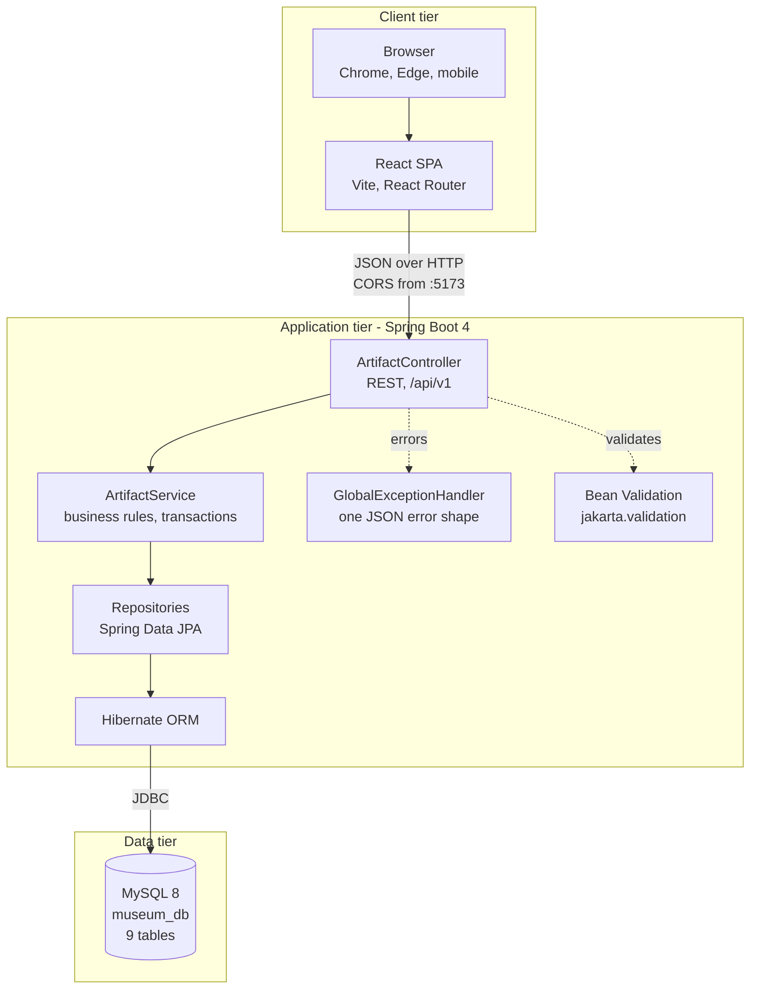

# System Architecture

Three tiers: a React single-page app, a Spring Boot REST API, and MySQL. The
browser never talks to the database; every read and write goes through the API.

## Technology choices and why

| Layer | Choice | Reason |
| --- | --- | --- |
| Frontend | React 19 + Vite | Fast dev server, standard component model, meets the SPA requirement |
| Routing | React Router 7 | Five routes including a catch-all 404 |
| State | Context + useReducer | Global notices and theme without a third-party store |
| API | Spring Boot 4, Spring MVC | REST controllers, content negotiation, embedded Tomcat |
| Persistence | Spring Data JPA, Hibernate 7 | Declarative repositories plus Criteria specifications for dynamic filters |
| Database | MySQL 8 | Relational integrity for a 9-table normalized model |
| Validation | jakarta.validation | Same constraints at the DTO boundary and on the entity |
| Build | Maven, npm | Standard toolchains, wrapper committed so the build is reproducible |

## Request path, end to end

1. The browser requests `GET /api/v1/artifacts?status=ON_DISPLAY`.
2. `ArtifactController` binds query parameters and a `Pageable`.
3. `ArtifactService` composes JPA Criteria specifications from the non-null filters.
4. `ArtifactRepository.findAll(spec, pageable)` runs with an entity graph that
   eagerly loads `collection` and `location`, avoiding an N+1 query.
5. Entities are mapped to `ArtifactResponse` records, so no entity reaches the JSON layer.
6. Any exception is converted by `GlobalExceptionHandler` into the documented error body.

## Cross-cutting decisions

- `spring.jpa.open-in-view=false`. Lazy associations are fetched deliberately with
  entity graphs rather than accidentally during serialization.
- `spring.jpa.hibernate.ddl-auto=validate`. `database/schema.sql` is the source of
  truth; the application refuses to start if the entities disagree with it.
- Database credentials come from the `DB_PASSWORD` environment variable, never the repository.
- Tests run against in-memory H2, so the build needs no local MySQL.

## Not yet implemented

- Authentication and authorization (Spring Security with JWT) - planned, Phase 4.
- Cloud deployment and CI/CD - out of scope for this submission.