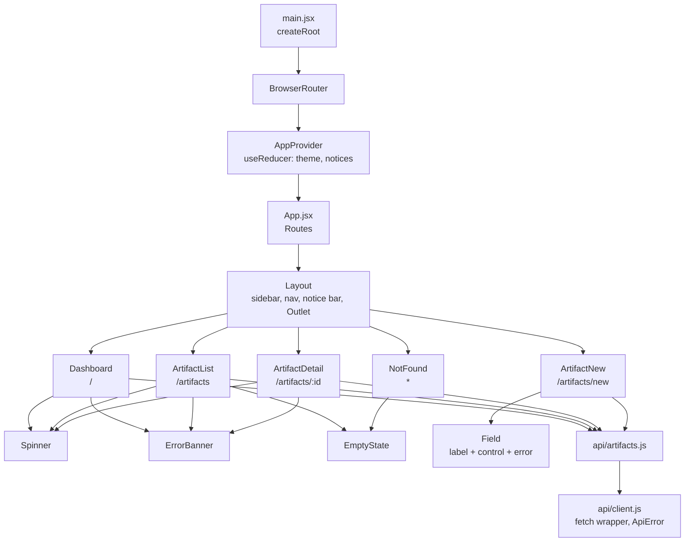

# React Component Diagram

## Components

| Component | Responsibility | Reused by |
| --- | --- | --- |
| `Layout` | Sidebar navigation, notice bar, skip link, page frame | every route |
| `Spinner` | Accessible loading indicator | Dashboard, ArtifactList, ArtifactDetail |
| `ErrorBanner` | Failed request with a retry action | Dashboard, ArtifactList, ArtifactDetail |
| `EmptyState` | No-results and not-found messaging | ArtifactList, NotFound |
| `Field` | Label, control, hint and inline error wired for screen readers | ArtifactNew |

## Hook usage

| Hook | Where | Purpose |
| --- | --- | --- |
| `useState` | all pages | form values, filters, loading and error flags |
| `useEffect` | Dashboard, ArtifactList, ArtifactDetail | trigger the fetch when inputs change |
| `useCallback` | the same pages, AppContext | stable fetch functions so effects do not loop |
| `useMemo` | Dashboard, AppContext | status tallies; stable context value |
| `useReducer` | AppContext | theme and notice transitions in one place |
| `useContext` | Layout, ArtifactDetail, ArtifactNew | read global notices without prop drilling |

## Routes

| Path | Component | Notes |
| --- | --- | --- |
| `/` | Dashboard | counts by status, five most recent |
| `/artifacts` | ArtifactList | search, status filter, pagination |
| `/artifacts/new` | ArtifactNew | client-side validation, 409 mapped to the field |
| `/artifacts/:id` | ArtifactDetail | full record, deaccession action |
| `*` | NotFound | catch-all 404 |